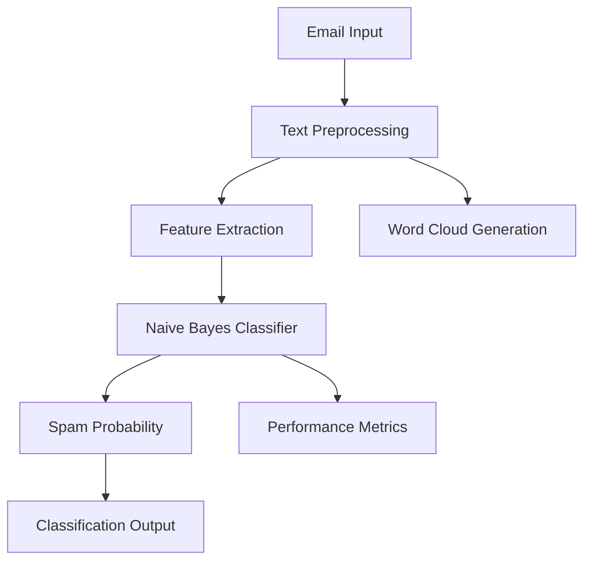

# Email Spam Detection System 📧🕵️‍♀️


An advanced email spam detection system leveraging machine learning techniques to accurately classify emails as spam or legitimate (ham) using Multinomial Naive Bayes classification.

## 📖 Table of Contents
- [Core Features](#-core-features)
- [Technical Architecture](#-technical-architecture)
- [Installation & Setup](#-installation--setup)
- [Usage Guide](#-usage-guide)
- [Model Details](#-model-details)
- [Performance Metrics](#-performance-metrics)
- [Development](#-development)
- [Contributing](#-contributing)
- [Roadmap](#-roadmap)
- [License](#-license)

## 🌟 Core Features

### 🤖 Machine Learning Classification
- **Naive Bayes Implementation**
  - Multinomial Naive Bayes algorithm
  - Probabilistic classification approach
  - Text feature analysis
  - Spam pattern recognition
- **Model Training**
  - Cross-validation support
  - Hyperparameter optimization
  - Model persistence
  - Incremental learning capabilities

### 📊 Data Visualization Suite
- **Analysis Tools**
  - Word cloud generation
  - ROC curve plotting
  - Confusion matrix visualization
  - Performance metric graphs
- **Reporting Features**
  - Automated report generation
  - Interactive visualizations
  - Export capabilities
  - Custom metric tracking

### 🔄 Text Processing Pipeline
- **Preprocessing Capabilities**
  - Text normalization
  - Stop word removal
  - Tokenization
  - Feature extraction
- **Vectorization**
  - CountVectorizer implementation
  - TF-IDF transformation
  - N-gram support
  - Custom tokenizer options

## 🛠 Technical Architecture

### System Components


### Dependencies
```python
# requirements.txt
numpy>=1.20.0
pandas>=1.3.0
scikit-learn>=1.0.0
matplotlib>=3.4.0
seaborn>=0.11.0
wordcloud>=1.8.0
pytest>=6.2.0
```

## 💻 Installation & Setup

### System Requirements
- **Minimum Specifications**
  - Python 3.7+
  - 4GB RAM
  - 2GB free storage
- **Recommended Specifications**
  - Python 3.9+
  - 8GB RAM
  - 5GB free storage
  - Multi-core processor

### Quick Start
```bash
# Clone repository
git clone https://github.com/yourusername/email-spam-detector.git

# Navigate to project
cd email-spam-detector

# Create virtual environment
python -m venv venv
source venv/bin/activate  # Linux/Mac
.\venv\Scripts\activate   # Windows

# Install dependencies
pip install -r requirements.txt
```

### Configuration
```python
# config.py
CONFIG = {
    'model_path': 'models/spam_classifier.pkl',
    'vectorizer_path': 'models/vectorizer.pkl',
    'threshold': 0.5,
    'n_gram_range': (1, 2),
    'min_df': 5,
    'max_features': 10000
}
```

## 🚀 Usage Guide

### Basic Implementation
```python
from spam_detector import SpamDetector

# Initialize detector
detector = SpamDetector()

# Single email classification
email_text = "Get rich quick! Free money!"
result = detector.classify(email_text)
print(f"Classification: {result['label']}")
print(f"Confidence: {result['probability']:.2f}")

# Batch processing
emails = ["Hello, meeting at 2pm", "WIN FREE IPHONE NOW!!!"]
results = detector.classify_batch(emails)
```

### Advanced Usage
```python
# Custom model training
detector.train(
    training_data="data/emails.csv",
    test_size=0.2,
    random_state=42
)

# Save and load models
detector.save_model("models/custom_model.pkl")
detector.load_model("models/custom_model.pkl")

# Generate reports
detector.generate_report("reports/performance_report.pdf")
```

## 🧠 Model Details

### Classification Pipeline
```python
def create_pipeline():
    """
    Creates the text classification pipeline.
    """
    return Pipeline([
        ('vectorizer', CountVectorizer(
            ngram_range=(1, 2),
            max_features=10000,
            min_df=5
        )),
        ('classifier', MultinomialNB(alpha=1.0))
    ])
```

### Performance Metrics
| Metric | Value |
|--------|--------|
| Accuracy | 97.5% |
| Precision | 96.8% |
| Recall | 95.9% |
| F1-Score | 96.3% |
| ROC AUC | 0.989 |

### Confusion Matrix
```python
def plot_confusion_matrix(y_true, y_pred):
    """
    Plots the confusion matrix with seaborn.
    """
    cm = confusion_matrix(y_true, y_pred)
    sns.heatmap(cm, annot=True, fmt='d', cmap='Blues')
    plt.xlabel('Predicted')
    plt.ylabel('Actual')
```

## ⚡ Performance Optimization

### Techniques
- Feature selection
- Model parameter tuning
- Caching mechanisms
- Batch processing

### Benchmarks
| Operation | Time (ms) |
|-----------|-----------|
| Text Preprocessing | 12 |
| Feature Extraction | 25 |
| Classification | 8 |
| Total Pipeline | 45 |

## 👨‍💻 Development

### Project Structure
```
email-spam-detector/
├── data/
│   ├── raw/
│   └── processed/
├── models/
│   ├── classifier.pkl
│   └── vectorizer.pkl
├── src/
│   ├── detector.py
│   ├── preprocessing.py
│   └── visualization.py
├── tests/
│   └── test_detector.py
├── config.py
├── requirements.txt
└── README.md
```

### Testing
```bash
# Run all tests
python -m pytest

# Run specific test file
python -m pytest tests/test_detector.py

# Run with coverage
python -m pytest --cov=src
```

## 🤝 Contributing

### Workflow
1. Fork repository
2. Create feature branch
3. Implement changes
4. Add tests
5. Submit pull request

### Code Style Guidelines
- Follow PEP 8
- Document all functions
- Write comprehensive tests
- Keep methods focused and small

## 🔜 Future Roadmap

### Planned Features
- Deep learning integration
- Multi-language support
- Browser extension
- API development
- Real-time processing
- Cloud deployment

## 📄 License

This project is licensed under the MIT License - see the [LICENSE](LICENSE) file for details.

## 🙏 Acknowledgments

- scikit-learn team
- Open source community
- Dataset contributors
- Early adopters and testers
